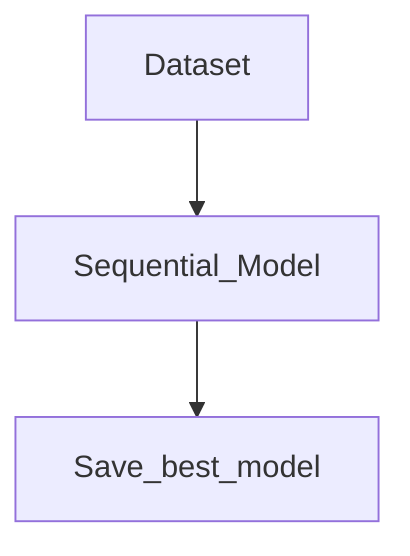
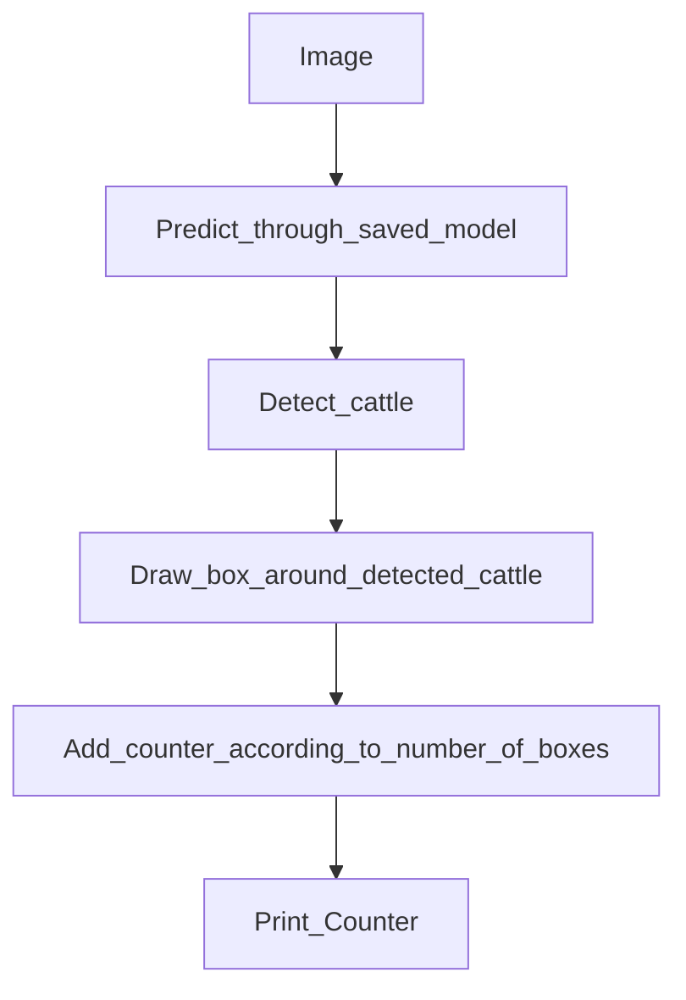

# Cattle Counter Application

The Cattle Counter Application invloves feeding a image or a video of cattle and the application will detect the cattle present in the image/video. The application afte processing the image will return the count of the detected cattle.

## Tech Stacks Used
- OpenCV
- TensorFlow

## Dataset
Collected images from various online sources and merged them into a single dataset.

## Methodology

Using a seqential model to train the data.
The below presented flowchart represents the the model training process.

After training the model, the accuracy of the dataset was realised to be. Along with validation accuracy to be.

After the best model has been saved, a new image is fed into the model where the model detects the cattle present in the new image. Using OpenCV, we draw bounding boxes around the detected cattle. After call the cattle have been detected, a counter is placed to keep a count on the number of bounding boxes present.
The prpcess can be defined by the below presented flowchart.

